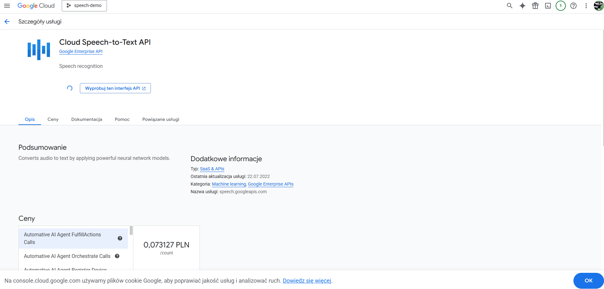
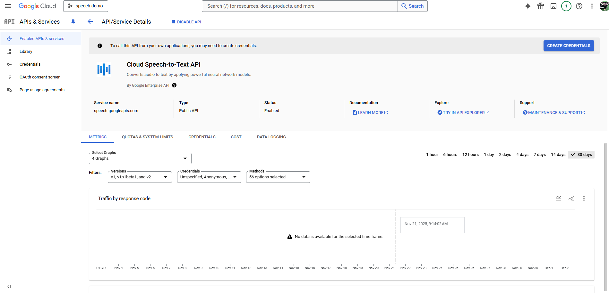
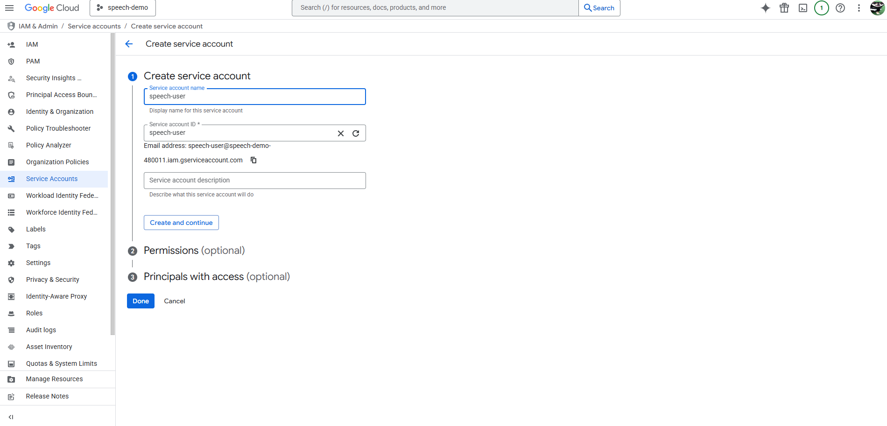
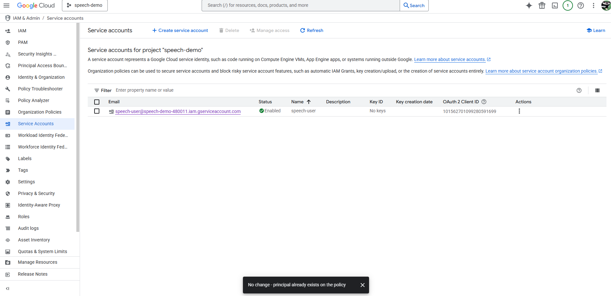
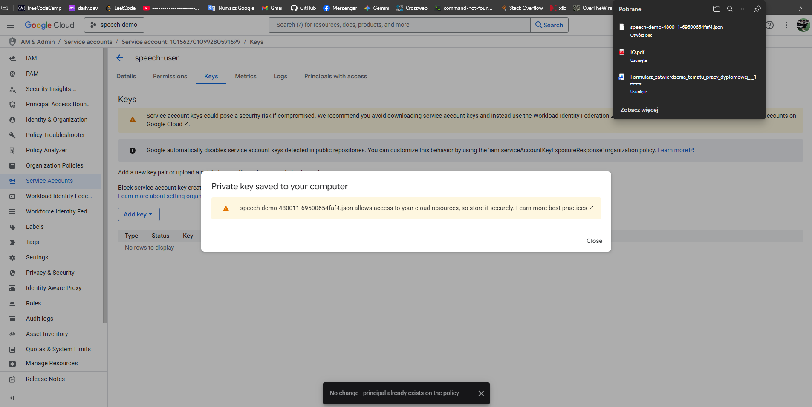
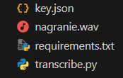
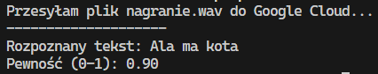

# GCP Speech-to-Text Integration

## Overview

This repository contains a Python-based implementation for interacting with the **Google Cloud Speech-to-Text API**. It allows for the transcription of Polish audio files (`.wav`) into text with high precision.

## Key Features

- **Automated Transcription:** Converts audio to text using Google's Deep Learning models.
- **Polish Language Support:** Configured for `pl-PL` language recognition.
- **Error Handling:** Implemented exception handling for network and configuration issues.

## Tech Stack

- **Language:** Python 3.x
- **Cloud Provider:** Google Cloud Platform (Speech-to-Text API)
- **Libraries:** `google-cloud-speech`

---

## Step-by-Step Configuration Guide

To replicate this environment, you need to configure the Google Cloud Console properly. Below is the infrastructure setup process.

### 1. Enable the API

First, navigate to the GCP API Library and enable the **Cloud Speech-to-Text API** for your project.



### 2. Service Account Setup (IAM)

For secure programmatic access, a dedicated Service Account is required.
Navigate to **IAM & Admin -> Service Accounts** and create a new identity (e.g., `speech-user`).



### 3. Generate JSON Key

Generate and download the private JSON key for the newly created Service Account. **This file must be kept secure.**


## Getting Started

### Prerequisites

- Python installed on your local machine.
- A downloaded GCP JSON key.

### Installation

Clone the repository and install the required libraries (as defined in `requirements.txt`):

```bash
pip install -r requirements.txt
```

(Or manually install the specific library: pip install google-cloud-speech)

### Local Directory Structure

Ensure your local workspace matches this structure. **Crucially, ensure key.json is added to your .gitignore file before any commits.**



### Execution

Run the transcription script:

```bash
python transcribe.py
```

### Expected Output

If configured correctly, the script will send the .wav payload to GCP and return the transcribed text along with the confidence score.


